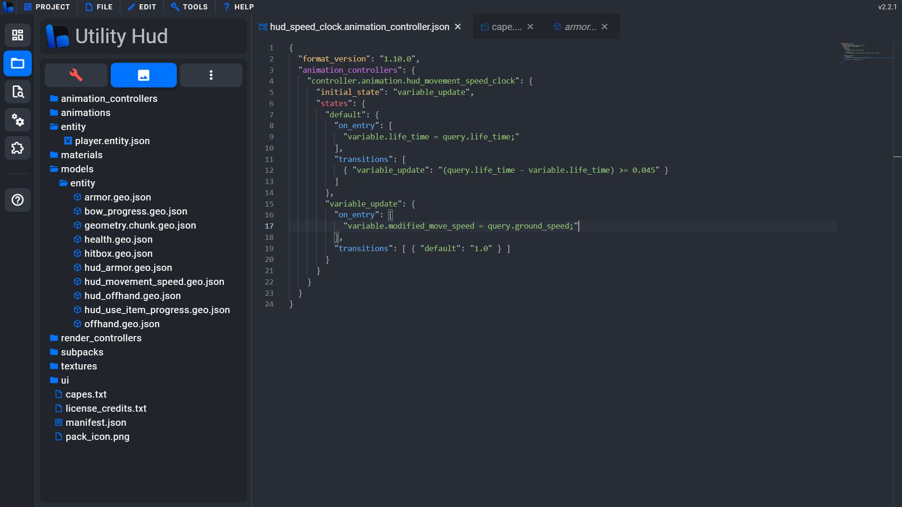

# Bridge - OneDark
### OneDark theme for the bridge v2 editor.

---

### Credits

[Original One Dark Syntax theme](https://github.com/atom/one-dark-syntax)

[One Dark Pro Theme for VSC](https://github.com/Binaryify/OneDark-Pro) (some colors taken)

[Utility HUD Pack by ambiennt](https://mcpedl.com/utility-hud-pack/) (used in the preview screenshot)

Me :)